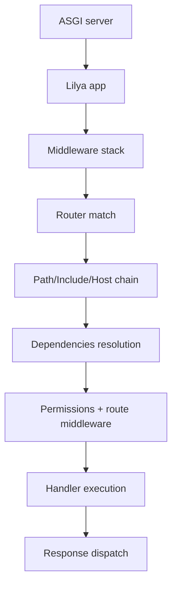
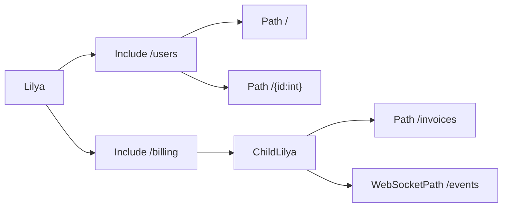

# Architecture Overview

Lilya is built in layers. Each layer is small and composable, and all of them are ASGI-first.

If you understand these layers, it becomes much easier to design bigger applications without losing control.

## Core building blocks

The main pieces are:

* `Lilya` / `ChildLilya` - The application entry point.
* `Router` - Matches incoming scope data to routes.
* `Path` - HTTP route unit.
* `WebSocketPath` - WebSocket route unit.
* `Include` - Composes route groups and mounted sub-applications.
* `Host` - Host-based routing for domain-aware apps.

Under the hood, middleware, permissions, dependencies, and exception handlers are all layered and merged while dispatching.

## Request lifecycle (HTTP)

At a high level, this is what happens for a typical HTTP request:

1. ASGI server calls the app with `scope`, `receive`, and `send`.
2. `Lilya` builds or reuses the middleware stack.
3. `Router` finds the best matching `Path`/`Include`/`Host`.
4. Dependencies are collected from app/include/route/handler levels.
5. Permissions and middleware for the matched route chain are applied.
6. Handler runs and returns a response (or body content Lilya can convert to a response).
7. Response is sent through the ASGI send channel.

The same idea is used for WebSockets, but with `websocket.connect`, `websocket.receive`, and `websocket.close` events.



## Route composition model

`Include` is one of the key pieces in Lilya architecture.

It allows:

* grouping route trees;
* loading routes from a namespace (`route_patterns` by default);
* mounting another ASGI app;
* applying middleware/permissions/dependencies per include boundary.

This lets you treat each feature area as a sub-system, instead of keeping everything in one large route list.



## Layers and precedence

For most concerns (middleware, permissions, dependencies, exception handlers), Lilya merges by route chain:

* App-level
* Include-level
* Route-level
* Handler-level (when applicable)

Settings precedence follows this order:

* Explicit parameters passed to `Lilya(...)`
* `settings_module` passed to app
* `LILYA_SETTINGS_MODULE`
* Lilya defaults

## Dependency resolution model

Lilya supports request-aware dependencies (`Provide`/`Provides`/`Resolve`) and request-less DI (`Depends` + `inject`).

Dependency scopes are:

* `request` - per request/websocket call
* `app` - cached per app instance
* `global` - shared globally

You can override dependencies at runtime using:

* `app.override_dependency(...)`
* `app.reset_dependency_overrides()`

This is especially useful in tests.

## Fast path and performance note

For common cases, Lilya can take a fast path for HTTP route dispatch (for example when middleware/route state allows direct route optimization).

You do not need special code for this; it is internal behavior in `Lilya`.

## Introspection for architecture visibility

Lilya exposes an application graph to inspect how your app is assembled:

```python
from lilya.apps import Lilya

app = Lilya(routes=[...])

graph = app.graph
print(graph.nodes())
print(graph.edges())
```

For deeper graph usage and route explain traces, check [Introspection](./introspection.md).

## Practical architecture pattern

A common production setup:

* One root `Lilya`.
* Multiple feature `ChildLilya` apps.
* Mounted via `Include`.
* Shared global middleware and logging.
* Feature-local dependencies and permissions.

This keeps startup simple while still allowing clear boundaries between teams and domains.

## Where to go next

To continue from here:

1. [Routing](./routing.md) for composition and matching behavior.
2. [Dependencies](./dependencies.md) for scoped dependency design.
3. [Middleware](./middleware.md) for cross-cutting request policies.
4. [Introspection](./introspection.md) for graph-level inspection and audits.
