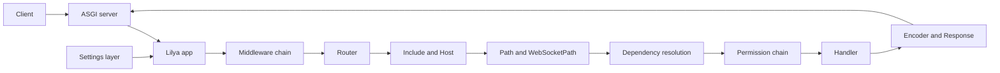
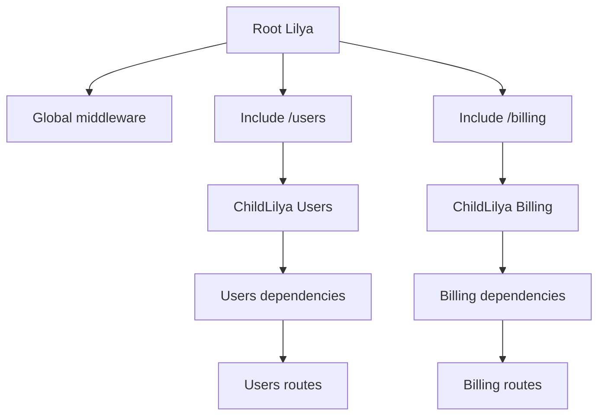

# Component Interactions

This page shows how Lilya components collaborate at runtime.

## System architecture

## Component interaction graph

## Use this model to decide boundaries

- Use `Include` for feature grouping
- Use `ChildLilya` for stronger module boundaries
- Keep shared concerns centralized, feature concerns local

## Related reference pages

- [Architecture Overview](../architecture.md)
- [Routing](../routing.md)
- [Introspection](../introspection.md)

## Next steps

- [Build a Modular API](../tutorials/build-a-modular-api.md)
