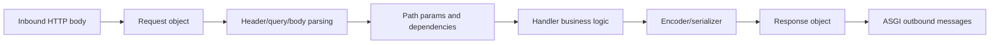

# Layering and Precedence

Lilya composes behavior across nested layers. Most configuration follows predictable precedence rules.

## Layer model

Typical chain for middleware, permissions, dependencies, and handlers:

1. Application layer
2. Include or Host layer
3. Route layer
4. Handler-level declarations (when supported)

## Settings precedence

1. Explicit parameters passed to `Lilya(...)`
2. `settings_module` on app instance
3. `LILYA_SETTINGS_MODULE`
4. Lilya defaults

## Data flow

## Design implications

- Put cross-cutting concerns at app/include level
- Keep route-level declarations focused on local policy
- Use handler-level dependency declarations for explicit contracts

## Related reference pages

- [Architecture Overview](../architecture.md)
- [Settings](../settings.md)
- [Applications](../applications.md)

## Next steps

- [Component Interactions](./component-interactions.md)
- [Developer Workflow](../guides/developer-workflow-local-dev-test-debug.md)
