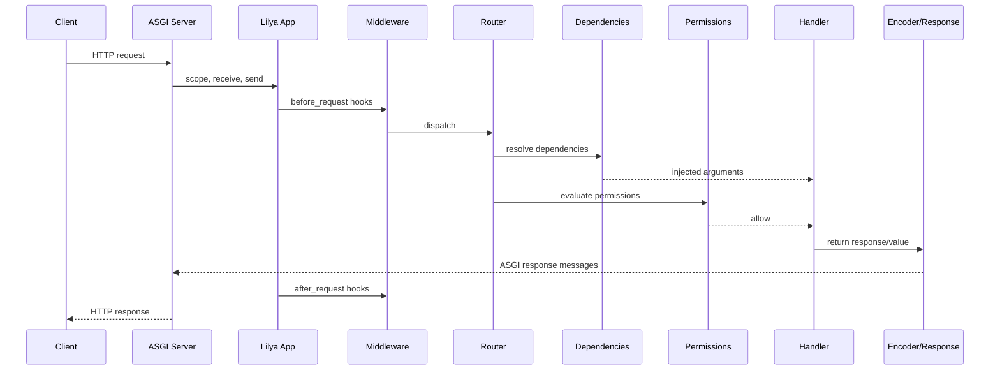

# Request Lifecycle

This page describes the end-to-end HTTP flow in Lilya.

## Lifecycle sequence

## Execution phases

1. Inbound entry and middleware wrapping
2. Route matching and include/host resolution
3. Dependency resolution by layer
4. Permission checks
5. Handler execution
6. Response encoding and dispatch
7. Post-response hooks

## Related reference pages

- [Requests](../requests.md)
- [Routing](../routing.md)
- [Dependencies](../dependencies.md)
- [Permissions](../permissions.md)
- [Responses](../responses.md)

## Next steps

- [Layering and Precedence](./layering-and-precedence.md)
- [Troubleshooting](../troubleshooting.md)
