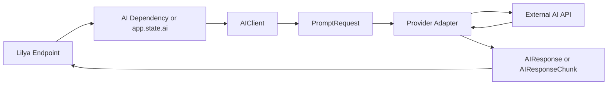

# AI

The `lilya.contrib.ai` package gives Lilya a **provider-agnostic integration layer for LLM applications**.

It is designed for teams that want to use AI inside Lilya applications without coupling their codebase to one vendor, one SDK, or one transport style.

With this contrib package you can:

* configure a provider with typed dataclasses
* call models through one stable `AIClient` API
* switch between providers without rewriting endpoint logic
* inject the AI client into Lilya handlers with dependency injection
* stream model output token-by-token or chunk-by-chunk
* support OpenAI-compatible vendors like **OpenAI**, **Groq**, and **Mistral**
* support providers with different wire protocols such as **Anthropic**

## Why This Exists

Most teams eventually want AI features inside their application, but the raw integration surface quickly becomes messy:

* provider-specific SDK imports leak everywhere
* request payloads differ from vendor to vendor
* streaming code gets duplicated in route handlers
* swapping vendors becomes expensive
* tests become tightly coupled to one external API format

`lilya.contrib.ai` solves that by separating the problem into two layers:

1. **Application layer**
   Your handlers, services, and dependencies talk to `AIClient`.
2. **Provider layer**
   Provider adapters translate Lilya's normalized request objects into the wire format required by each vendor.

That means your Lilya code stays clean even if your infrastructure changes later.

## Installation

Install the AI extra:

```bash
pip install "lilya[ai]"
```

At the moment, the base AI integration uses `httpx` for outbound provider calls.

## Supported Provider Families

Lilya's AI contrib intentionally distinguishes between:

### 1. OpenAI-compatible providers

These providers expose a request/response contract close to `POST /v1/chat/completions`.

Examples:

* OpenAI
* Groq
* Mistral
* any self-hosted or gateway provider that mirrors the same API surface

Use:

* `OpenAICompatibleProvider`
* `OpenAIProvider`
* `GroqProvider`
* `MistralProvider`

### 2. Non-compatible providers

Some vendors use different wire formats, headers, and streaming event shapes.

Example:

* Anthropic Messages API

Use:

* `AnthropicProvider`

## Architecture



### Main building blocks

| Component | Responsibility |
| --- | --- |
| `ChatMessage` | Provider-agnostic chat message representation |
| `PromptRequest` | Normalized AI request object |
| `AIClient` | Main API used by Lilya apps |
| `AIResponse` | Non-streaming response object |
| `AIResponseChunk` | Streaming chunk object |
| `setup_ai()` | Attaches a configured AI client to the Lilya app |
| `AI` | Dependency injection helper that resolves the configured client |
| Provider classes | Translate Lilya request objects to vendor-specific HTTP payloads |

## Quick Start

### OpenAI

```python
from lilya.apps import Lilya
from lilya.contrib.ai import AIClient, OpenAIConfig, OpenAIProvider, setup_ai

provider = OpenAIProvider(
    OpenAIConfig(
        api_key="your-openai-key",
    )
)

client = AIClient(
    provider,
    default_model="gpt-4o-mini",
    default_system_prompt="You are a concise assistant for Lilya users.",
)

app = Lilya()
setup_ai(app, client=client)
```

### Groq

```python
from lilya.contrib.ai import AIClient, GroqConfig, GroqProvider

provider = GroqProvider(
    GroqConfig(
        api_key="your-groq-key",
    )
)

client = AIClient(provider, default_model="llama-3.3-70b-versatile")
```

### Mistral

```python
from lilya.contrib.ai import AIClient, MistralConfig, MistralProvider

provider = MistralProvider(
    MistralConfig(
        api_key="your-mistral-key",
    )
)

client = AIClient(provider, default_model="mistral-small-latest")
```

### Anthropic

```python
from lilya.contrib.ai import AIClient, AnthropicConfig, AnthropicProvider

provider = AnthropicProvider(
    AnthropicConfig(
        api_key="your-anthropic-key",
    )
)

client = AIClient(provider, default_model="claude-sonnet-4-20250514")
```

## Core Types

### `ChatMessage`

Use `ChatMessage` to build provider-neutral conversations.

```python
from lilya.contrib.ai import ChatMessage

messages = [
    ChatMessage.system("You are a release note generator."),
    ChatMessage.user("Summarize the latest deployment."),
]
```

Convenience constructors are available:

* `ChatMessage.system(...)`
* `ChatMessage.user(...)`
* `ChatMessage.assistant(...)`
* `ChatMessage.tool(...)`

### `PromptRequest`

`PromptRequest` is the normalized request shape sent from `AIClient` to providers.

It contains:

* `messages`
* `model`
* `system_prompt`
* `temperature`
* `max_tokens`
* `top_p`
* `stop_sequences`
* `metadata`
* `extra`

You usually do not instantiate `PromptRequest` directly in application code. `AIClient` builds it for you.

### `AIResponse`

Returned for non-streaming calls.

Fields:

* `text`
* `model`
* `provider`
* `finish_reason`
* `usage`
* `raw`

### `AIResponseChunk`

Returned during streaming.

Fields:

* `text`
* `delta`
* `model`
* `provider`
* `finish_reason`
* `raw`

## Configuration Dataclasses

### Shared base config

```python
from lilya.contrib.ai import AIProviderConfig
```

Base fields:

* `api_key`
* `base_url`
* `timeout`
* `headers`

### OpenAI-compatible config

```python
from lilya.contrib.ai import OpenAICompatibleConfig
```

Additional fields:

* `provider_name`
* `organization`
* `project`

### Provider-specific convenience configs

Available convenience configs:

* `OpenAIConfig`
* `GroqConfig`
* `MistralConfig`
* `AnthropicConfig`

`AnthropicConfig` also includes:

* `anthropic_version`
* `default_max_tokens`

## Using `AIClient`

### Simple prompt

```python
result = await client.prompt(
    "Write a short release note for the latest deployment.",
)

print(result.text)
```

### Chat conversation

```python
from lilya.contrib.ai import ChatMessage

result = await client.chat(
    [
        ChatMessage.system("You are a customer support assistant."),
        ChatMessage.user("A customer cannot log in after resetting their password."),
    ]
)

print(result.text)
```

### Override model or request settings

```python
result = await client.prompt(
    "Create three title options for a product page.",
    model="gpt-4o-mini",
    temperature=0.9,
    max_tokens=200,
)
```

### Pass provider-specific extras

The `extra` field lets you pass through advanced provider parameters without contaminating the common API.

```python
result = await client.prompt(
    "Return a JSON object with summary and priority.",
    extra={"response_format": {"type": "json_object"}},
)
```

This is useful when:

* one provider supports a feature not yet normalized by Lilya
* you want to experiment without changing the contrib core
* you need provider-specific tuning knobs

## Startup Integration

Attach the AI client to your Lilya app with `setup_ai()`.

```python
from lilya.apps import Lilya
from lilya.contrib.ai import AIClient, OpenAIConfig, OpenAIProvider, setup_ai

provider = OpenAIProvider(OpenAIConfig(api_key="..."))
client = AIClient(provider, default_model="gpt-4o-mini")

app = Lilya()
setup_ai(app, client=client)
```

What `setup_ai()` does:

* stores the client on `app.state.ai`
* optionally registers startup and shutdown handlers
* keeps AI setup in one place instead of scattered across routes

## Dependency Injection

Use the `AI` dependency to inject the configured `AIClient` into handlers.

```python
from lilya.contrib.ai import AI, ChatMessage

@app.post("/summary", dependencies={"ai": AI})
async def generate_summary(ai: AI):
    result = await ai.chat(
        [ChatMessage.user("Summarize today's customer issues in three bullets.")]
    )
    return {"summary": result.text}
```

This is the recommended integration style because it:

* keeps handlers easy to test
* avoids direct provider construction inside routes
* follows the same pattern Lilya already uses for other contrib services

## Streaming

Streaming is essential for chat UIs, assistant surfaces, terminals, and progressive rendering.

### Stream from a simple prompt

```python
async for chunk in client.stream("Explain ASGI to a beginner."):
    print(chunk.delta, end="")
```

### Stream from a chat conversation

```python
async for chunk in client.stream_chat(
    [
        ChatMessage.system("You are a pair-programming assistant."),
        ChatMessage.user("Help me debug a 502 gateway error."),
    ]
):
    print(chunk.delta, end="")
```

### Streaming in a Lilya endpoint

```python
from lilya.responses import StreamingResponse

@app.get("/stream", dependencies={"ai": AI})
async def stream_answer(ai: AI):
    async def body():
        async for chunk in ai.stream("Write a short changelog entry."):
            if chunk.delta:
                yield chunk.delta

    return StreamingResponse(body(), media_type="text/plain")
```

## Real-World Usage Patterns

### 1. Internal knowledge assistant

Use Lilya as the HTTP edge while the AI contrib handles the provider abstraction.

Flow:

1. authenticate the user
2. retrieve domain context from your own database or search system
3. build messages with that context
4. call `AIClient`
5. return or stream the result

### 2. Support ticket summarization

```python
ticket_text = """
Customer cannot access billing.
Payment method was updated yesterday.
They now receive a 403 in the billing portal.
"""

result = await ai.prompt(
    f"Summarize this support ticket and suggest the likely next troubleshooting step:\\n\\n{ticket_text}"
)
```

### 3. Structured draft generation

Use `extra` to pass provider-specific structured output options while keeping the rest of your code provider-neutral.

### 4. Content moderation or classification front door

Even if your final application logic is not conversational, `AIClient` is still useful for:

* categorization
* summarization
* extraction
* rewriting
* intent detection

### 5. Coding assistants for internal tools

Because the API is streaming-capable and dependency-injection-friendly, it fits well for:

* internal IDE plugins
* review helpers
* changelog drafting
* support reply drafting
* documentation generation

## OpenAI-Compatible Providers in Detail

The `OpenAICompatibleProvider` is one of the most important pieces of this contrib package.

It exists because many vendors intentionally mirror the OpenAI chat completions contract.

That means the **same application code** can often work with:

* OpenAI
* Groq
* Mistral
* compatible gateways
* self-hosted proxies exposing the same interface

Example:

```python
from lilya.contrib.ai import AIClient, OpenAICompatibleConfig, OpenAICompatibleProvider

provider = OpenAICompatibleProvider(
    OpenAICompatibleConfig(
        provider_name="my-gateway",
        base_url="https://llm-gateway.internal/v1",
        api_key="internal-token",
        headers={"X-Tenant": "alpha"},
    )
)

client = AIClient(provider, default_model="meta-llama/llama-4")
```

This is the recommended extension path when a vendor already follows the same payload shape.

## Anthropic in Detail

Anthropic uses a different messages API than OpenAI-compatible vendors, so Lilya ships a dedicated adapter.

Important differences:

* authentication headers differ
* the `anthropic-version` header is required
* `system` content is a top-level field
* response and streaming event shapes differ

The Lilya adapter hides those differences behind the same `AIClient` methods.

## Error Handling

The package exposes a small exception hierarchy:

* `AIError`
* `AIConfigurationError`
* `ProviderNotConfigured`
* `AIProviderError`
* `AIResponseError`

Recommended usage:

```python
from lilya.contrib.ai import AIProviderError

try:
    result = await ai.prompt("Summarize this page.")
except AIProviderError:
    return {"error": "The AI provider is currently unavailable."}
```

## Testing

You do not need real provider calls in most tests.

Test at three levels:

### 1. Route or service tests

Inject a fake `AIClient` dependency.

### 2. Client-level tests

Use a fake provider that records `PromptRequest` objects.

### 3. Provider adapter tests

Mock the HTTP transport and assert:

* request path
* request headers
* request payload translation
* response parsing
* streaming behavior

This repo includes dedicated tests for all of these patterns.

## Production Guidance

### Keep provider setup centralized

Create the provider and client once during startup.

### Prefer dependency injection over direct global access

Use `AI` in handlers rather than reaching into `request.app.state.ai` everywhere.

### Use timeouts intentionally

Long-running generation can tie up request time if you do not set reasonable timeout values.

### Stream for interactive workloads

If the user is waiting in a chat-like interface, prefer `stream()` or `stream_chat()`.

### Log provider failures at the boundary

The best place to log provider failures is where application context still exists:

* route handler
* service layer
* background job wrapper

## Troubleshooting

### `RuntimeError: httpx is required for lilya.contrib.ai`

Install the extra:

```bash
pip install "lilya[ai]"
```

### `No model was provided`

Set a default model on `AIClient` or pass `model=` for the request.

### `No AIClient configured`

Make sure you called `setup_ai(app, client=...)`.

### Streaming returns nothing

Check:

* the provider supports streaming for that model
* your route is returning a streaming response correctly
* you are consuming `chunk.delta`

### The provider is compatible, but not fully

Use `OpenAICompatibleProvider` for providers that are mostly compatible, then pass vendor-specific options through `extra`. If the wire format is genuinely different, add a dedicated provider adapter instead of overloading the common one.

## Reference Summary

| API | Purpose |
| --- | --- |
| `AIClient.prompt()` | Single-prompt non-streaming call |
| `AIClient.chat()` | Multi-message non-streaming call |
| `AIClient.stream()` | Single-prompt streaming call |
| `AIClient.stream_chat()` | Multi-message streaming call |
| `setup_ai()` | Register client on app state and lifecycle |
| `AI` | Inject configured client into Lilya handlers |
| `OpenAICompatibleProvider` | OpenAI-style compatible provider adapter |
| `AnthropicProvider` | Anthropic messages API adapter |

## Provider Defaults Verified

The built-in defaults in this module are based on the vendors' official documentation:

* OpenAI chat completions under `https://api.openai.com/v1`
* Groq OpenAI compatibility under `https://api.groq.com/openai/v1`
* Mistral chat completions under `https://api.mistral.ai/v1`
* Anthropic Messages API under `https://api.anthropic.com/v1/messages` with `anthropic-version: 2023-06-01`

Those defaults are still fully overridable through the configuration dataclasses if your deployment uses a proxy, gateway, or self-hosted compatibility layer.
