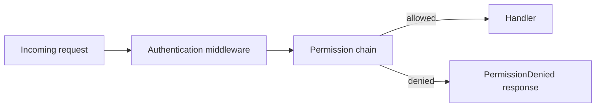

# Tutorial: Add Auth and Permissions

This tutorial layers authentication and authorization onto a modular Lilya app.

## Goal

Protect selected routes with authentication middleware and permission classes.

## Step 1: Add authentication middleware

Use [Authentication](../authentication.md) and [Middleware](../middleware.md#baseauthmiddleware--authenticationmiddleware).

## Step 2: Define permission policy

Apply permissions at app, include, or route level depending on scope of policy.

## Step 3: Verify behavior

Test unauthenticated and unauthorized requests and verify exception handling.

## Access flow

## Related references

- [Authentication](../authentication.md)
- [Permissions](../permissions.md)
- [Exceptions](../exceptions.md)

## Next tutorial

- [Realtime with WebSockets](./realtime-with-websockets.md)
