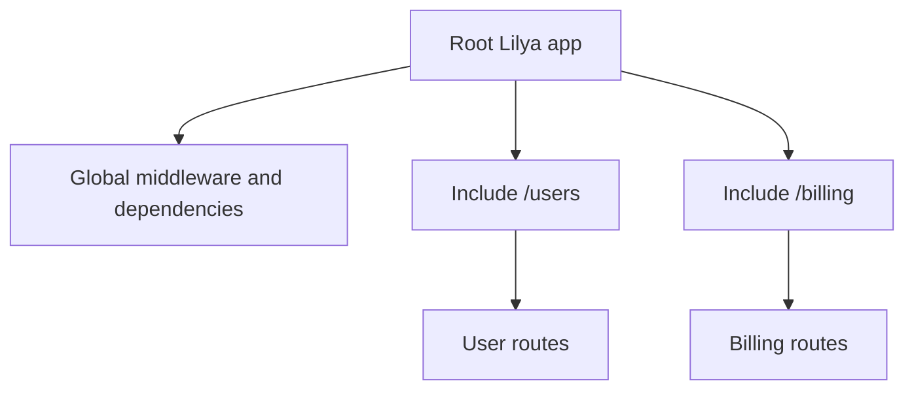

# Tutorial: Build a Modular API

This tutorial evolves a single app into a modular service using `Include` and `ChildLilya`.

## Goal

Build a root app with two feature modules and clear ownership boundaries.

## Step 1: Start from a basic app

Use the same baseline structure as [Applications](../applications.md).

## Step 2: Create feature routers

Group routes by domain (`users`, `billing`, etc.) and expose each as module-level route trees.

## Step 3: Compose with include boundaries

Mount feature trees with `Include` to control middleware, permissions, and dependencies per feature.

## Step 4: Add shared and local concerns

- Shared: app-level logging, error handling
- Local: include-level authorization, dependencies

## Architecture sketch

## Validation checklist

- Route names are unique and reversible
- Include prefixes are explicit
- Feature-specific middleware is local to feature boundaries

## Related references

- [Routing](../routing.md)
- [Dependencies](../dependencies.md)
- [Middleware](../middleware.md)

## Next tutorial

- [Add Auth and Permissions](./add-auth-and-permissions.md)
