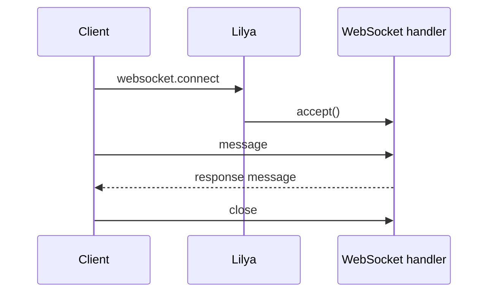

# Tutorial: Realtime with WebSockets

This tutorial adds a realtime channel to an existing Lilya app.

## Goal

Expose one websocket endpoint and test it locally.

## Step 1: Register a websocket route

```python
{!> ../../../docs_src/websockets/websocket.py !}
```

## Step 2: Co-locate HTTP and websocket routes

Keep websocket routes in the same feature module when they share dependencies and permissions.

## Step 3: Test handshake and message flow

Use the [Test Client](../test-client.md) to validate connect, send, and close behavior.

## Realtime flow



## Related references

- [WebSocket](../websockets.md)
- [Routing](../routing.md#websocketpath)
- [Test Client](../test-client.md)

## Next steps

- [Production Readiness Checklist](../guides/production-readiness-checklist.md)
